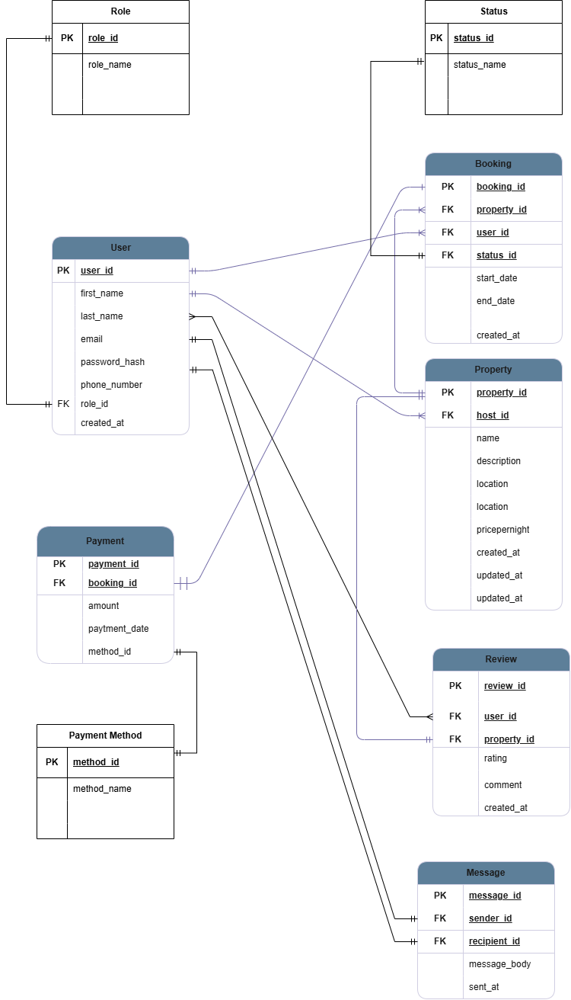

# Entity Relationship Diagram for Airbnb Database

## 🧱 Entities and Attributes

- **User**: user_id, first_name, email, role_id, etc.
- **Property**: property_id, name, location, host_id, etc.
- **Booking**: booking_id, user_id, property_id, start_date, end_date, status_id
- **Payment**: payment_id, booking_id, amount, method_id
- **Review**: review_id, user_id, property_id, rating, comment
- **Message**: sender_id, recipient_id, message_body

## 🔗 Relationships

- A user can host multiple properties
- A user can book multiple properties
- A booking can have one payment and one review
- Users can send messages to each other

## 📊 ER Diagram

> This diagram shows all tables and relationships clearly. Each entity has a UUID-based primary key and proper foreign key constraints.
