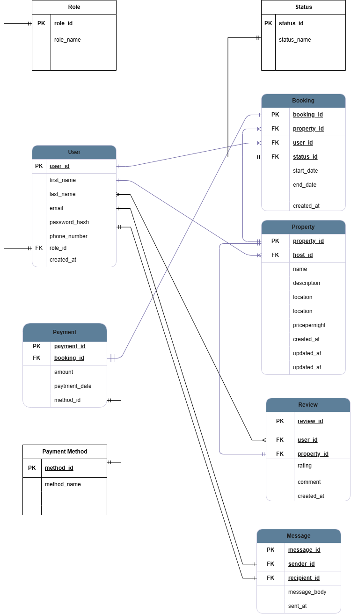

# 🏠 ALX Airbnb Database Project

This repository contains the database design and implementation for an **Airbnb-like booking platform**, developed as part of the **ALX Software Engineering Program**. It showcases advanced SQL practices including data modeling, normalization, schema creation with UUIDs, and indexing for performance.

---

##  Overview

This project builds a relational database that supports the key operations of an Airbnb platform:

- User and role management
- Property listings and hosting
- Booking reservations and statuses
- Payment processing
- User reviews
- Messaging between users

It ensures strong data integrity and scalability by using `UUID` as primary keys and indexing critical fields.

---

##  Features

- ✅ Third Normal Form (**3NF**) normalization
- ✅ `UUID` primary keys using `pgcrypto` extension
- ✅ Strong `FOREIGN KEY` constraints and `CHECK`s
- ✅ Efficient indexing on searchable and foreign key columns
- ✅ Realistic Airbnb-style schema design

---

##  ER Diagram

---

##  Database Schema

All SQL table creation statements are included in [`schema.sql`](../schema.sql).

### Key Tables

- `users`: stores user profile info
- `roles`: defines user roles (host, guest, admin)
- `properties`: rental property listings
- `bookings`: reservations made by users
- `payments`: transaction records for bookings
- `reviews`: feedback and ratings from guests
- `messages`: communication between users

### Lookup Tables

- `status`: booking statuses (pending, confirmed, cancelled)
- `payment_method`: supported payment types

---

##  Normalization

Normalization steps and decisions are documented in [`normalization.md`](../normalization.md).

- Eliminated repeating groups and multivalued attributes
- Applied functional dependencies to split redundant data
- Ensured each non-key attribute depends only on the primary key

